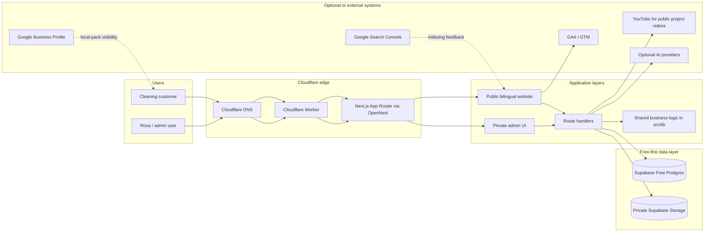
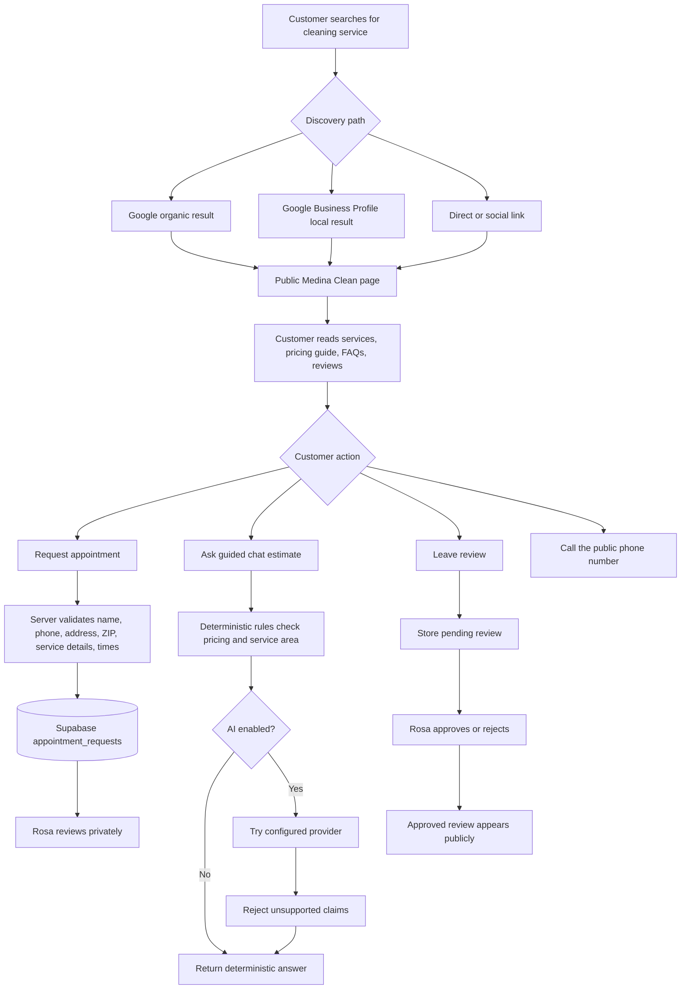
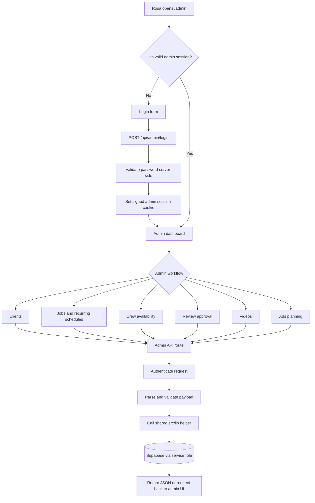
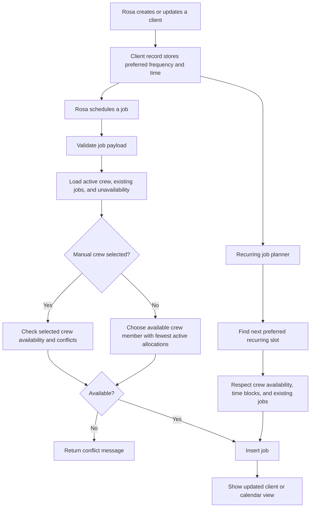
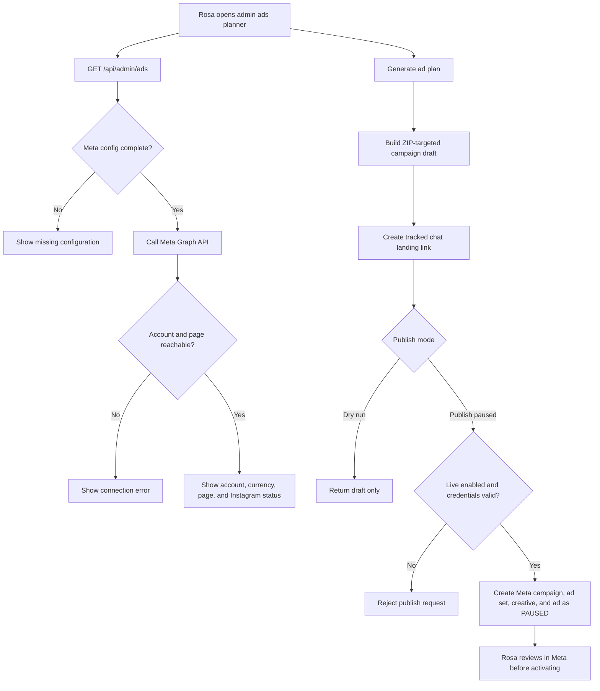
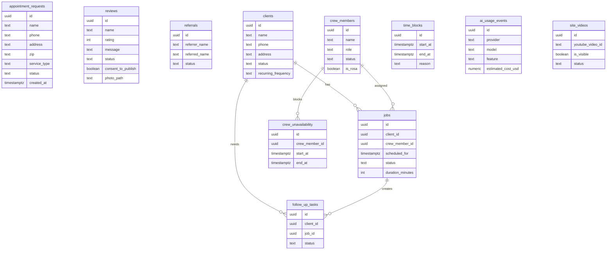
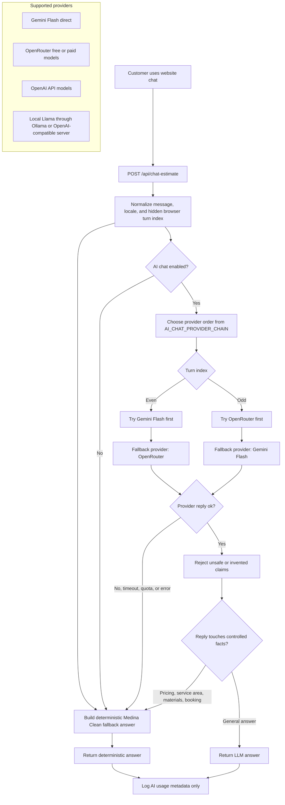

# Medina Clean

Bilingual, zero-subscription-fee-first website and lightweight operations app for Rosa Medina's cleaning services in the Woodstock, GA area.

Built by Northvalley Intelligence LLC: https://northvalleyintel.com


## Project Thesis

Medina Clean was designed around one hard constraint: the business should not need recurring software subscription fees to run the public website or the first version of the admin workflow.

That constraint shaped the architecture:

- Hosting runs on Cloudflare Workers through OpenNext.
- Data storage uses Supabase Free.
- Address eligibility uses local ZIP centroid validation instead of paid maps APIs.
- Public SEO uses crawlable content, sitemap, robots, canonical URLs, local service pages, and JSON-LD instead of paid discovery tools.
- The admin app uses first-party server routes and Supabase tables instead of paid CRM, booking, review, or field-service software.
- AI features are optional and guarded by deterministic application logic, with usage logging so cost can be reviewed before any paid provider decision.

## Article Outline

This project can be written as a two-part article.

Part 1: Public Website

- Building a bilingual local-service website for a small cleaning business.
- Keeping the first viewport clear: cleaning services, service area, and appointment request.
- Local SEO for Woodstock, GA and nearby cities using crawlable service pages.
- Structured data for `CleaningService`, `LocalBusiness`, service offers, FAQs, and local service pages.
- Free service-area validation using ZIP data instead of Google Maps billing.
- Privacy-safe lead capture, review submission, and moderated public reviews.
- Optional chat estimates with deterministic guardrails.

Part 2: Admin UI

- Turning the same Next.js app into Rosa's private operations workspace.
- Spanish-first admin screens with English available.
- Protecting private routes with server-side authentication.
- Managing clients, jobs, crew availability, reviews, videos, ads planning, and follow-up tasks.
- Using Supabase Row Level Security and service-role-only admin writes.
- Preserving the $0 subscription principle while leaving room for future paid services only when the business approves them.

## Zero-Subscription Design Principles

The guiding rule is not "never pay for software." The rule is: do not require paid subscriptions before the business has enough volume to justify them.

Practical decisions:

- No paid Google Maps dependency.
- No Twilio/SMS dependency for launch.
- No paid email provider required for launch.
- No paid CRM, booking, or review platform.
- No paid analytics requirement.
- No paid media storage requirement for basic review photos.
- No automatic production dependency on a paid AI model.

The tradeoff is that some workflows are intentionally simple:

- Rosa manually confirms exact address availability after the ZIP check.
- Appointment requests are requests, not instant confirmed bookings.
- Google Business Profile and Search Console still need external setup because Google local-pack visibility cannot be solved only with website code.
- AI answers are constrained and can fall back to deterministic copy instead of inventing prices or service-area claims.

## Stack

- Next.js App Router
- TypeScript
- Supabase Free for appointment requests, moderated reviews, referrals, clients, jobs, crew data, AI usage metadata, and public video records
- Cloudflare Workers deployment through OpenNext
- GitHub Actions for CI and main-branch production deploys
- Playwright for browser-visible workflows
- Vitest for business rules and backend helpers
- Local ZIP-radius validation against the 30188 service center

## High-Level Architecture



## Public Website

The public side is built for local discovery and trust without requiring paid tools.

Core public pages and features:

- `/en` and `/es` bilingual home pages.
- Dedicated local service pages, such as `/en/house-cleaning-woodstock-ga`.
- Dedicated nearby-city pages for Marietta, Kennesaw, Acworth, Canton, and Roswell coverage.
- Appointment request form with server validation.
- Review submission with moderation before publishing.
- Optional review headshot upload, resized client-side and stored privately.
- Before-and-after video section backed by admin-managed YouTube links.
- Guided chat estimate with deterministic fallbacks.
- `robots.txt`, `sitemap.xml`, canonical URLs, and bilingual alternates.

### Public Website Flow



### Local SEO Surface

The website gives search engines stable local signals:

- Business name: `Medina Clean`.
- Service types: house cleaning, apartment cleaning, condo cleaning, deep cleaning, recurring cleaning, small business cleaning.
- Service area: Woodstock, GA, ZIP `30188`, and nearby Georgia communities.
- Service pages with human-readable copy and FAQs.
- Canonical URLs and `hreflang` alternates.
- Structured data for the home page and local service pages.
- Permanent redirects for legacy indexed URLs.

### What Website Code Cannot Do

The website can improve organic discovery, but the Google "business tab" and map/local-pack behavior depends mostly on external Google configuration:

- Google Business Profile must be created, verified, and kept accurate.
- Search Console should verify `medinaclean.com` and submit `https://medinaclean.com/sitemap.xml`.
- Real customer reviews on Google Business Profile matter for local pack trust.
- Photos, services, hours, service area, phone, and appointment URL should be maintained inside Google Business Profile.

## Admin UI

The admin side is Rosa's private operations workspace inside the same app. It avoids a paid CRM or booking product while keeping private data off the public site.

Admin priorities:

- Spanish-first interface for Rosa.
- English option for testing and support.
- Server-side admin authentication.
- Private data access only through backend routes.
- Shared validation and scheduling helpers in `src/lib`.
- Thin API routes: authenticate, parse, call helpers, persist, respond.

Current admin areas:

- Dashboard and attention tasks.
- Client onboarding and client detail pages.
- Job scheduling and recurring job planning.
- Crew members and crew unavailability.
- Calendar and blocked time.
- Review approval.
- Public video upload and visibility management.
- Ads planning workspace with draft/tracking-link generation.
- Meta Ads readiness checks for account, page, and optional Instagram connection.

### Admin Request Flow



### Admin Scheduling Flow



### Meta Ads Readiness Flow

The admin ads workspace is designed to prepare campaigns without accidentally spending money.

Meta live publishing remains disabled unless all of these are true:

- `META_ADS_LIVE_ENABLED=true`
- `META_ACCESS_TOKEN` is configured.
- `META_AD_ACCOUNT_ID` is configured.
- `META_PAGE_ID` is configured.
- Optional `META_INSTAGRAM_ACTOR_ID` is configured when Instagram placement needs a specific actor.
- The Meta app, ad account, page permissions, and billing setup are ready in Meta Business Manager.

The backend can inspect whether the configured ad account and page are reachable. If live publishing is unavailable, the admin UI still produces draft campaign details and tracked chat links.



## Data Model



## Security And Privacy

The public site collects only what Rosa needs to respond:

- Name
- Phone
- Address or ZIP
- Service details
- Preferred appointment times
- Review text and optional low-resolution review photo with consent

Security controls:

- Supabase Row Level Security is enabled on public tables.
- Public users can insert appointment and review submissions but cannot read private appointment data.
- Reviews are private until approved.
- Admin routes require server-side authentication.
- Service-role keys stay on the server.
- Review photo access goes through a server route.
- AI usage logging stores metadata, not full private conversations.

## Website Chat LLM Flow

The public chat assistant can use hosted or local OpenAI-compatible chat providers, but pricing, service-area checks, material claims, and appointment submission stay guarded by deterministic application code.



Current production configuration can alternate providers by browser-session turn while keeping deterministic rules as the final fallback. OpenAI and local Llama/Ollama can be used by setting the OpenAI-compatible base URL, model, and API key in the same provider configuration pattern. See `docs/ai-usage-and-local-llm.md`.

## Local Development

```bash
npm install
npm run dev
```

Copy `.env.example` to `.env.local` after creating a Supabase Free project.

For isolated local database and browser integration testing, see `docs/local-testing.md`.

Useful test commands:

```bash
npm run lint
npm run test:coverage
npm run test:e2e
npm run test:e2e:db
npm run typecheck
npm run build
```

## Deployment

Deployments are configured through GitHub Actions to Cloudflare Workers. Production deploys must come from `main`.

Normal production path:

1. Work on a feature branch.
2. Open a pull request.
3. Let CI pass, including lint, typecheck, coverage tests, Playwright tests, production build, and Cloudflare/OpenNext build.
4. Merge the PR into `main`.
5. The `main` push triggers the Cloudflare production deploy.
6. Verify production behavior directly after deployment.

Local Cloudflare checks:

```bash
npm run cf:build
npm run cf:preview
```

Do not add billing unless explicitly approved.

## Supabase Setup

1. Create one Supabase project for Rosa only.
2. Run the migrations in `supabase/migrations/` or apply `supabase/schema.sql`.
3. Create a private storage bucket named `review-headshots`.
4. Add environment variables from `.env.example` to the host.

The schema enables Row Level Security on every public table. After running it, verify that RLS is enabled for:

- `appointment_requests`
- `reviews`
- `referrals`
- `clients`
- `jobs`
- `crew_members`
- `crew_unavailability`
- `time_blocks`
- `ai_usage_events`
- `site_videos`

Public users can submit appointments and reviews. They cannot read private appointment submissions. Reviews only appear after Rosa approves them.

## GitHub Governance

See `docs/github-governance.md` for the PR gate, CI, Dependabot, and branch-protection plan. Branch protection/rulesets require a GitHub plan that supports private-repo enforcement or a public repository.
